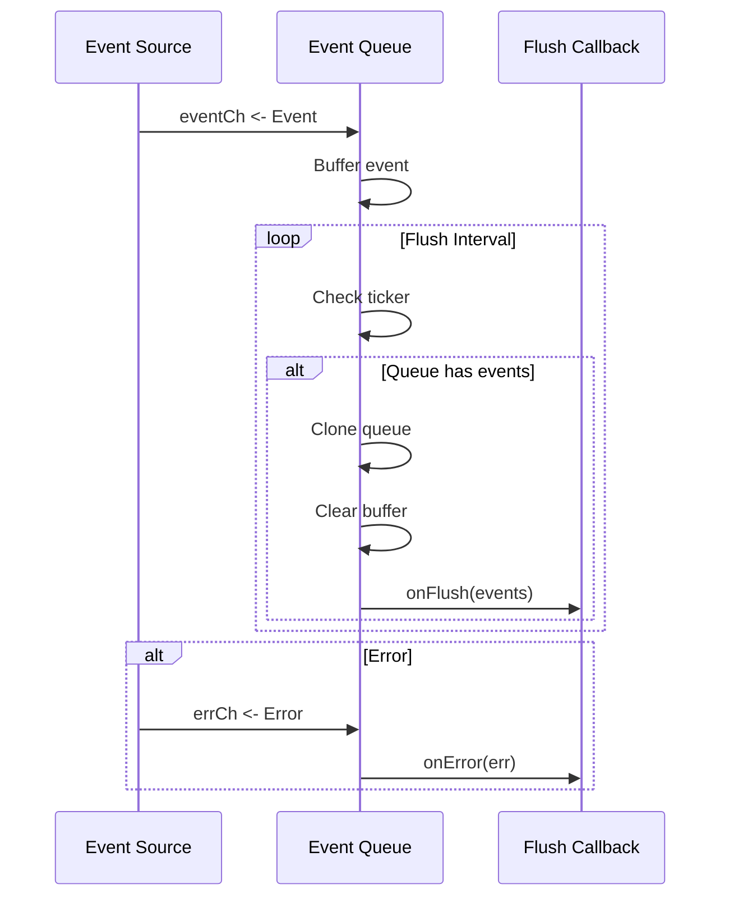
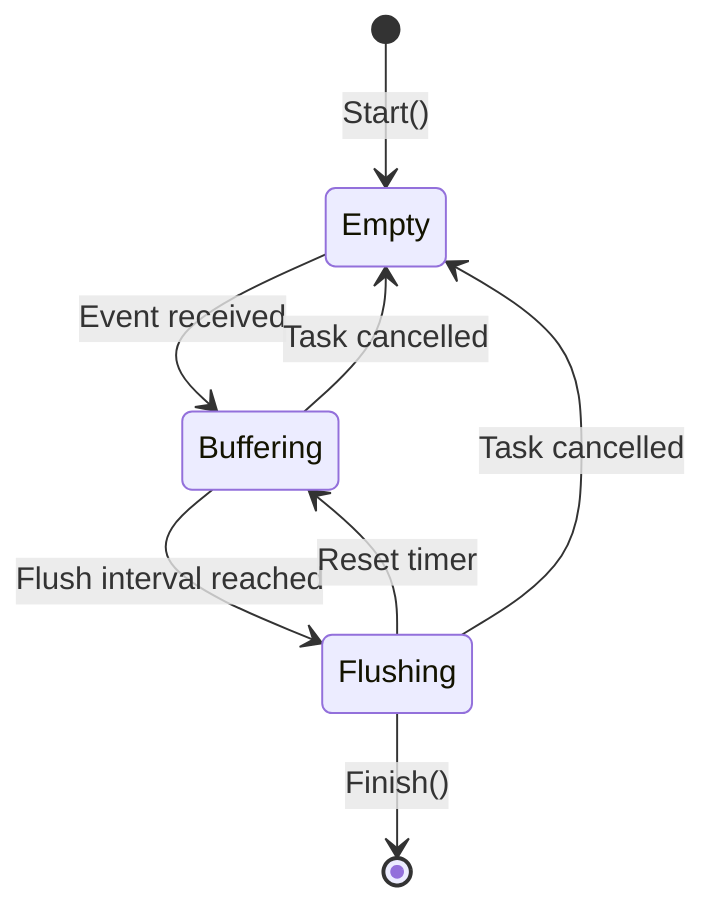

# Event Queue

A generic, buffered event queue with batch processing and configurable flush intervals.

## Overview

The `eventqueue` package provides a generic event queue implementation that buffers events and flushes them in batches at configurable intervals. It is designed for scenarios where event aggregation reduces processing overhead and improves efficiency.

### Purpose

- **Event Aggregation**: Buffer multiple events and process them together
- **Batch Processing**: Flush events at configurable intervals for efficiency
- **Lifecycle Management**: Integrated with [`task.Task`](https://pkg.go.dev/github.com/yusing/goutils/task) for controlled shutdown
- **Error Handling**: Panic recovery and error callback propagation

### Primary Consumers

- [`internal/watcher/events`](internal/watcher/events) - Uses this package for Docker and file events
- Any package requiring buffered event processing with batch flush

### Non-goals

- Does not implement event persistence or storage
- Does not provide event filtering or transformation
- Does not handle event acknowledgments

### Stability

Public API is stable. Generic type parameter allows any `Event` type.

## Quick Start

```go
import (
    "time"
    "github.com/yusing/goutils/eventqueue"
    "github.com/yusing/goutils/task"
)

type MyEvent struct {
    ID   string
    Type string
}

queue := eventqueue.New(task.Subtask("my-events"), eventqueue.NewOptions[MyEvent]{
    FlushInterval: 5 * time.Second,
    Capacity:      100,
    OnFlush: func(events []MyEvent) {
        // Process batch of events
    },
    OnError: func(err error) {
        // Handle errors
    },
})

queue.Start(eventCh, errCh)
```

## Public API

### Exported Types

#### EventQueue

```go
type EventQueue[Event any] struct {
    task          *task.Task
    queue         []Event
    ticker        *time.Ticker
    flushInterval time.Duration
    onFlush       OnFlushFunc[Event]
    onError       OnErrorFunc
    debug         bool
}
```

A generic event queue that buffers events and flushes them in batches.

**Fields:**

| Field           | Type                 | Description                           |
| --------------- | -------------------- | ------------------------------------- |
| `task`          | `*task.Task`         | Lifetime management for the queue     |
| `queue`         | `[]Event`            | Internal buffer for pending events    |
| `ticker`        | `*time.Ticker`       | Timer for flush intervals             |
| `flushInterval` | `time.Duration`      | How often to flush buffered events    |
| `onFlush`       | `OnFlushFunc[Event]` | Callback invoked with batch of events |
| `onError`       | `OnErrorFunc`        | Callback invoked on errors or panics  |
| `debug`         | `bool`               | Enable debug mode for stack traces    |

#### OnFlushFunc

```go
type OnFlushFunc[Event any] = func(events []Event)
```

Callback invoked when the flush interval is reached and the queue contains events.

#### OnErrorFunc

```go
type OnErrorFunc = func(err error)
```

Callback invoked when:

- An error is received from the error channel
- A panic occurs in `OnFlushFunc`

#### NewOptions

```go
type NewOptions[Event any] struct {
    Capacity      int
    FlushInterval time.Duration
    OnFlush       OnFlushFunc[Event]
    OnError       OnErrorFunc
    Debug         bool
}
```

Configuration options for constructing a new `EventQueue`.

| Field           | Type                 | Default | Description                              |
| --------------- | -------------------- | ------- | ---------------------------------------- |
| `Capacity`      | `int`                | 10      | Maximum number of events to buffer       |
| `FlushInterval` | `time.Duration`      | -       | How often to flush events (required)     |
| `OnFlush`       | `OnFlushFunc[Event]` | -       | Callback for batch processing (required) |
| `OnError`       | `OnErrorFunc`        | -       | Callback for error handling (optional)   |
| `Debug`         | `bool`               | `false` | Include stack traces on panic            |

### Exported Functions

#### New

```go
func New[Event any](queueTask *task.Task, opt NewOptions[Event]) *EventQueue[Event]
```

Creates a new `EventQueue` with the provided configuration.

**Parameters:**

- `queueTask` - Task for lifetime management. Must not be nil.
- `opt` - Configuration options including callbacks and flush interval

**Behavior:**

- Starts a goroutine for event processing
- Events are buffered until flush interval is reached
- Panics in `OnFlush` are recovered and sent to `OnError`
- If `queueTask` is cancelled before flush, events are discarded

#### Start

```go
func (e *EventQueue[Event]) Start(eventCh <-chan Event, errCh <-chan error)
```

Begins processing events from the provided channels.

**Parameters:**

- `eventCh` - Channel receiving events to buffer
- `errCh` - Channel receiving errors to handle

**Lifecycle:**

1. Starts a goroutine that selects on:
   - Task cancellation (`<-task.Context().Done()`)
   - Flush ticker (`<-e.ticker.C`)
   - Event channel (`event, ok := <-eventCh`)
   - Error channel (`err, ok := <-errCh`)

2. On flush: clones queue, clears it, invokes `onFlush`

3. On panic: recovers, sends error to `onError`, continues

4. On task done: stops ticker, calls `task.Finish(nil)`

## Architecture

### Event Flow



### Queue States



### Core Components

| Component           | Responsibility                               |
| ------------------- | -------------------------------------------- |
| `EventQueue[Event]` | Generic queue with buffering and batch flush |
| `task.Task`         | Lifetime management and cancellation         |
| `time.Ticker`       | Periodic flush triggering                    |
| `OnFlushFunc`       | Batch event processor                        |
| `OnErrorFunc`       | Error and panic handler                      |

## Configuration Surface

### Options

| Parameter       | Type            | Default | Description                                |
| --------------- | --------------- | ------- | ------------------------------------------ |
| `Capacity`      | `int`           | 10      | Maximum buffer size; blocks sender if full |
| `FlushInterval` | `time.Duration` | -       | Required; interval between flushes         |
| `OnFlush`       | `func([]Event)` | -       | Required; called with batch                |
| `OnError`       | `func(error)`   | nil     | Optional; error handler                    |
| `Debug`         | `bool`          | false   | Include stack traces on panic              |

### Capacity Behavior

```go
const defaultEventQueueCapacity = 10
```

- Queue has fixed capacity; `append` blocks if full
- Excess events may block the sender until space is available
- Use larger capacity for high-throughput scenarios

## Dependency and Integration Map

### Internal Dependencies

| Package                                                                               | Purpose                              |
| ------------------------------------------------------------------------------------- | ------------------------------------ |
| [`github.com/yusing/goutils/task`](https://pkg.go.dev/github.com/yusing/goutils/task) | Lifetime management and cancellation |
| [`github.com/yusing/goutils/errs`](https://pkg.go.dev/github.com/yusing/goutils/errs) | Error handling with subjects         |

### Integration Points

- **Event Sources**: Emit events via `eventCh` channel
- **Error Sources**: Emit errors via `errCh` channel
- **Processors**: Implement `OnFlushFunc` and `OnErrorFunc` callbacks

## Observability

### Logs

No direct logging. Errors propagated via `OnError` callback.

### Metrics

None exposed.

## Failure Modes and Recovery

| Failure          | Detection                 | Recovery                           |
| ---------------- | ------------------------- | ---------------------------------- |
| Channel closed   | `!ok` on receive          | Queue stops                        |
| Panic in onFlush | `recover()`               | Error sent to `onError`, continues |
| Task cancelled   | `<-task.Context().Done()` | Queue stops, events discarded      |
| Queue full       | `append()` blocks         | Sender blocks                      |

### Panic Recovery

```go
e.onFlush = func(events []Event) {
    defer func() {
        if errV := recover(); errV != nil {
            var err gperr.Error
            switch errV := errV.(type) {
            case error:
                err = gperr.PrependSubject(errV, e.task.Name())
            default:
                err = gperr.New("recovered panic in onFlush").Withf("%v", errV).Subject(e.task.Name())
            }
            if e.debug {
                err = err.Withf("%s", debug.Stack())
            }
            e.onError(err)
        }
    }()
    origOnFlush(events)
}
```

- Panics in `onFlush` are recovered and converted to errors
- Stack traces included if `Debug: true`

## Usage Examples

### Basic Setup

```go
import (
    "time"
    "github.com/yusing/goutils/eventqueue"
    "github.com/yusing/goutils/task"
)

type AppEvent struct {
    ID   string
    Data string
}

queue := eventqueue.New(
    task.Subtask("app-events"),
    eventqueue.NewOptions[AppEvent]{
        FlushInterval: 5 * time.Second,
        Capacity:      50,
        OnFlush: func(events []AppEvent) {
            for _, e := range events {
                process(e)
            }
        },
        OnError: func(err error) {
            log.Error().Err(err).Msg("event queue error")
        },
    },
)
```

### Integration with Event Sources

```go
func watchEvents(ctx context.Context) error {
    eventCh := make(chan AppEvent, 100)
    errCh := make(chan error, 10)

    go produceEvents(ctx, eventCh, errCh)

    queue := eventqueue.New(
        task.Subtask("event-processor"),
        eventqueue.NewOptions[AppEvent]{
            FlushInterval: 10 * time.Second,
            OnFlush: handleBatch,
            OnError: logError,
        },
    )

    queue.Start(eventCh, errCh)
    return nil
}

func handleBatch(events []AppEvent) {
    // Process all events in batch
    for _, e := range events {
        // Process each event
    }
}

func logError(err error) {
    // Handle or log error
}
```

### Custom Event Types

```go
type DockerEvent struct {
    ContainerID string
    Action      string
    Timestamp   time.Time
}

type FileEvent struct {
    Path    string
    Op      string
    Content []byte
}

// Use generic queue with different event types
dockerQueue := eventqueue.New(...)
fileQueue := eventqueue.New(...)
```

## Testing Notes

- Test with synthetic events via channel
- Verify batch ordering is preserved
- Test panic recovery by injecting panics in callback
- Verify task cancellation discards events correctly
- Test capacity limits by flooding the event channel

## Related Packages

- [`internal/watcher/events`](internal/watcher/events) - Docker/file events using this package
- [`github.com/yusing/goutils/task`](https://pkg.go.dev/github.com/yusing/goutils/task) - Task management
- [`github.com/yusing/goutils/errs`](https://pkg.go.dev/github.com/yusing/goutils/errs) - Error handling
