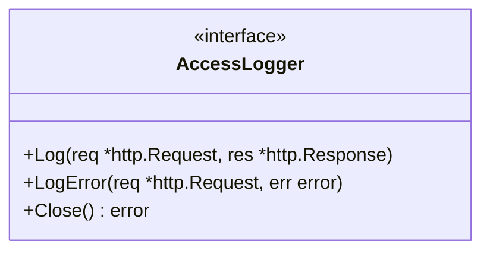

# goutils/http/accesslog

HTTP access logging interface for recording request and response details.

## Overview

The `accesslog` package defines an interface for logging HTTP request and response information. This abstraction allows different logging implementations (e.g., JSON logging, file logging, stdout logging) to be plugged into the reverse proxy and other HTTP handlers.

## Architecture

### Core Components



The `AccessLogger` interface provides three methods:

- **Log**: Called after a successful request/response cycle to log the request and response
- **LogError**: Called when an error occurs during request processing
- **Close**: Called to clean up resources when the logger is no longer needed

## API Reference

### AccessLogger Interface

```go
type AccessLogger interface {
    Log(req *http.Request, res *http.Response)
    LogError(req *http.Request, err error)
    Close() error
}
```

### Usage Example

```go
package main

import (
    "net/http"
    "github.com/yusing/goutils/http/accesslog"
)

// CustomAccessLogger implements accesslog.AccessLogger
type CustomAccessLogger struct {
    // implementation details
}

func (l *CustomAccessLogger) Log(req *http.Request, res *http.Response) {
    // Log successful request
}

func (l *CustomAccessLogger) LogError(req *http.Request, err error) {
    // Log error
}

func (l *CustomAccessLogger) Close() error {
    // Cleanup
}

// Usage in reverse proxy
func setupProxy() *reverseproxy.ReverseProxy {
    logger := &CustomAccessLogger{}
    return reverseproxy.NewReverseProxy("my-proxy", targetURL, transport,
        reverseproxy.WithAccessLogger(logger))
}
```

## Integration Points

This package is used by:

- `goutils/http/reverseproxy` - The reverse proxy logs requests and errors through this interface

## Related Packages

- [reverseproxy](../reverseproxy/README.md) - Uses AccessLogger for logging
