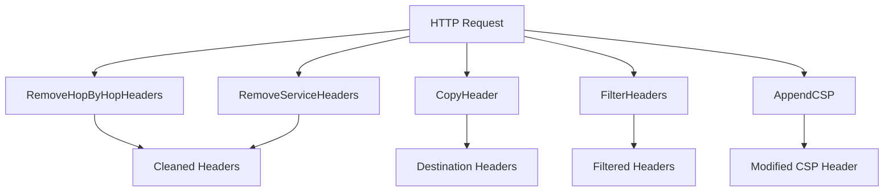

# httpheaders

HTTP headers utilities for proxy and middleware applications.

## Overview

The `httpheaders` package provides functions for managing HTTP headers in proxy and reverse proxy scenarios. It handles hop-by-hop header removal, CSP manipulation, WebSocket detection, and header copying utilities.

## Constants

### X-Forwarded Headers

```go
const (
    HeaderXForwardedMethod = "X-Forwarded-Method"
    HeaderXForwardedFor    = "X-Forwarded-For"
    HeaderXForwardedProto  = "X-Forwarded-Proto"
    HeaderXForwardedHost   = "X-Forwarded-Host"
    HeaderXForwardedPort   = "X-Forwarded-Port"
    HeaderXForwardedURI    = "X-Forwarded-Uri"
    HeaderXRealIP          = "X-Real-IP"
)
```

### Common Headers

```go
const (
    HeaderContentType   = "Content-Type"
    HeaderContentLength = "Content-Length"
)
```

## Architecture



## API Reference

### Header Removal Functions

#### RemoveHopByHopHeaders

```go
func RemoveHopByHopHeaders(h http.Header)
```

Removes hop-by-hop headers that should not be forwarded by proxies. This includes:

- Connection
- Proxy-Connection
- Keep-Alive
- Proxy-Authenticate
- Proxy-Authorization
- Te
- Trailer
- Transfer-Encoding
- Upgrade

Per RFC 7230, it also removes headers listed in the Connection header.

#### RemoveHop

```go
func RemoveHop(h http.Header)
```

Removes hop-by-hop headers while preserving the Upgrade header for WebSocket connections. Sets Connection: Upgrade if an upgrade is requested.

#### RemoveServiceHeaders

```go
func RemoveServiceHeaders(h http.Header)
```

Removes security-sensitive headers that reveal server information:

- X-Powered-By
- Server

### Header Copying and Filtering

#### CopyHeader

```go
func CopyHeader(dst, src http.Header)
```

Copies all headers from source to destination, preserving duplicate headers.

#### FilterHeaders

```go
func FilterHeaders(h http.Header, allowed []string) http.Header
```

Returns a new header map containing only the specified allowed headers. If `allowed` is empty, returns the original header map.

#### HeaderToMap

```go
func HeaderToMap(h http.Header) map[string]string
```

Converts an HTTP header map to a simple string map, taking only the first value for each header.

### Upgrade Detection

#### UpgradeType

```go
func UpgradeType(h http.Header) string
```

Returns the value of the Upgrade header if present, otherwise returns an empty string.

#### IsWebsocket

```go
func IsWebsocket(h http.Header) bool
```

Returns true if the request is a WebSocket upgrade request.

### CSP Manipulation

#### AppendCSP

```go
func AppendCSP(w http.ResponseWriter, r *http.Request, cspDirectives []string, sources []string)
```

Appends Content-Security-Policy sources to specific directives. This function:

- Parses existing CSP headers
- For specified directives, adds the provided sources
- Ensures 'self' is included in the sources if not already present
- Replaces 'none' with the provided sources
- Case-insensitively removes existing CSP headers before setting the new one

## Usage Examples

### Basic Proxy Header Handling

```go
package main

import (
    "net/http"
    "github.com/yusing/goutils/http/httpheaders"
)

func proxyHandler(w http.ResponseWriter, r *http.Request) {
    // Remove headers that should not be forwarded
    httpheaders.RemoveHopByHopHeaders(r.Header)

    // Remove service headers from response
    httpheaders.RemoveServiceHeaders(w.Header())

    // Add forwarding headers
    r.Header.Set(httpheaders.HeaderXForwardedFor, r.RemoteAddr)
    r.Header.Set(httpheaders.HeaderXForwardedHost, r.Host)
    r.Header.Set(httpheaders.HeaderXForwardedProto, "https")
}
```

### WebSocket Upgrade Detection

```go
func websocketHandler(w http.ResponseWriter, r *http.Request) {
    if httpheaders.IsWebsocket(r.Header) {
        // Handle WebSocket upgrade
        upgradeType := httpheaders.UpgradeType(r.Header)
        // ... handle upgrade
    }
}
```

### CSP Modification

```go
func cspMiddleware(next http.Handler) http.Handler {
    return http.HandlerFunc(func(w http.ResponseWriter, r *http.Request) {
        // Add self and cdn.example.com to img-src and script-src
        httpheaders.AppendCSP(w, r,
            []string{"img-src", "script-src"},
            []string{"'self'", "https://cdn.example.com"})
        next.ServeHTTP(w, r)
    })
}
```

### Header Filtering

```go
func filterSensitiveHeaders(r *http.Request) {
    allowed := []string{"Content-Type", "Authorization", "Accept"}
    filtered := httpheaders.FilterHeaders(r.Header, allowed)
    r.Header = filtered
}
```

## Integration Points

This package is used by:

- `goutils/http/reverseproxy` - For header manipulation in proxy requests
- `goutils/http/websocket` - For WebSocket detection

## Related Packages

- [reverseproxy](../reverseproxy/README.md) - Uses httpheaders for header manipulation
- [websocket](../websocket/README.md) - Uses IsWebsocket for upgrade detection
