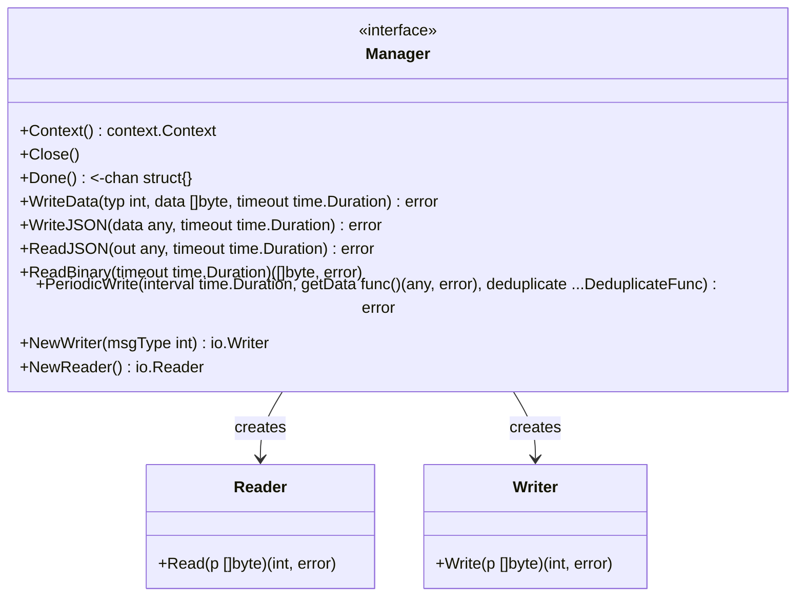
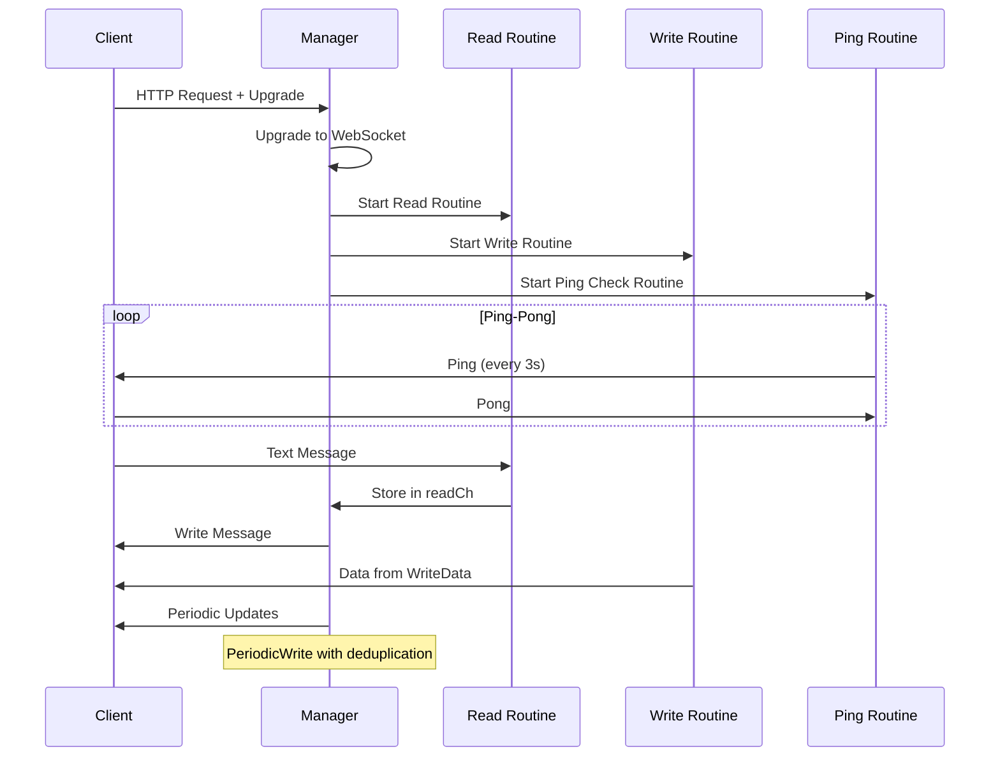

# websocket

WebSocket connection manager with automatic ping-pong, JSON messaging, and periodic updates.

## Overview

The `websocket` package provides a high-level WebSocket connection manager built on gorilla/websocket. It handles connection upgrades, automatic ping-pong keepalive, JSON encoding/decoding, and periodic data streaming with deduplication support.

## Architecture



## Data Flow



## Constants

```go
const (
    TextMessage   = websocket.TextMessage   // 1
    BinaryMessage = websocket.BinaryMessage // 2
)
```

## Errors

```go
var (
    ErrReadTimeout  = errors.New("read timeout")
    ErrWriteTimeout = errors.New("write timeout")
)
```

## API Reference

### Manager

#### NewManagerWithUpgrade

```go
func NewManagerWithUpgrade(c *gin.Context) (*Manager, error)
```

Upgrades an HTTP connection to a WebSocket connection. Returns a Manager on success.

**Features:**

- Origin validation (allows localhost/127.0.0.1, same origin matching)
- Per-message deflate compression support
- Automatic ping-pong keepalive (3s interval, 2s pong timeout)
- Context cancellation propagation

**Custom Upgrader:**
To use a custom upgrader, set the "upgrader" context value:

```go
c.Set("upgrader", customUpgrader)
manager, err := websocket.NewManagerWithUpgrade(c)
```

#### Context

```go
func (m *Manager) Context() context.Context
```

Returns the context associated with the manager.

#### Close

```go
func (m *Manager) Close()
```

Gracefully closes the WebSocket connection with a close frame.

#### Done

```go
func (m *Manager) Done() <-chan struct{}
```

Returns a channel that is closed when the context is done or connection is closed.

### Writing Messages

#### WriteData

```go
func (m *Manager) WriteData(typ int, data []byte, timeout time.Duration) error
```

Writes a raw message to the connection. Supports TextMessage and BinaryMessage types.

#### WriteJSON

```go
func (m *Manager) WriteJSON(data any, timeout time.Duration) error
```

JSON-marshals data and writes it as a TextMessage.

#### NewWriter

```go
func (m *Manager) NewWriter(msgType int) io.Writer
```

Creates an io.Writer for streaming messages to the connection.

### Reading Messages

#### ReadJSON

```go
func (m *Manager) ReadJSON(out any, timeout time.Duration) error
```

Reads a TextMessage, JSON-unmarshals it into the provided struct.

#### ReadBinary

```go
func (m *Manager) ReadBinary(timeout time.Duration) ([]byte, error)
```

Reads a binary message and returns the raw bytes.

#### NewReader

```go
func (m *Manager) NewReader() io.Reader
```

Creates an io.Reader for streaming messages from the connection.

### Periodic Updates

#### PeriodicWrite

```go
func (m *Manager) PeriodicWrite(interval time.Duration, getData func() (any, error), deduplicate ...DeduplicateFunc) error
```

Periodically fetches data and writes it to the connection. Features:

- Initial write before starting the ticker
- Automatic deduplication (uses DeepEqual by default)
- Stops when context is done or connection closes
- Returns first error encountered

### Deduplication

```go
type DeduplicateFunc func(last, current any) bool
```

Custom function to compare last and current data. Return true to skip writing.

### Utility Functions

#### PeriodicWrite

```go
func PeriodicWrite(c *gin.Context, interval time.Duration, get func() (any, error), deduplicate ...DeduplicateFunc)
```

Convenience function that upgrades and runs PeriodicWrite in one call.

#### DeepEqual

```go
func DeepEqual(last, current any) bool
```

Default deduplication function using reflection-based deep equality.

## Usage Examples

### Basic WebSocket Handler

```go
package main

import (
    "github.com/gin-gonic/gin"
    "github.com/yusing/goutils/http/websocket"
)

func wsHandler(c *gin.Context) {
    manager, err := websocket.NewManagerWithUpgrade(c)
    if err != nil {
        c.Error(err)
        return
    }
    defer manager.Close()

    // Read messages
    for {
        var data MyStruct
        err := manager.ReadJSON(&data, 10*time.Second)
        if err != nil {
            break
        }
        // Process data
    }
}
```

### Server-Sent Events with PeriodicWrite

```go
func statusHandler(c *gin.Context) {
    websocket.PeriodicWrite(c, 5*time.Second, func() (any, error) {
        return getStatusUpdate()
    })
}
```

### Custom Deduplication

```go
manager.PeriodicWrite(interval, getData, func(last, current any) bool {
    lastUpdate := last.(*StatusUpdate)
    currentUpdate := current.(*StatusUpdate)
    return lastUpdate.Version == currentUpdate.Version
})
```

### Broadcasting with Reader/Writer

```go
func pipeHandler(c *gin.Context) {
    manager, _ := websocket.NewManagerWithUpgrade(c)

    reader := manager.NewReader()
    writer := manager.NewWriter(websocket.TextMessage)

    io.Copy(writer, reader)
}
```

### Custom Upgrader

```go
customUpgrader := &websocket.Upgrader{
    CheckOrigin: func(r *http.Request) bool {
        return true // Allow all origins in development
    },
    EnableCompression: false,
}

c.Set("upgrader", customUpgrader)
manager, err := websocket.NewManagerWithUpgrade(c)
```

## Configuration

### Environment Variables

- `WEBSOCKET_DEBUG`: Enable debug logging for WebSocket connections
- `DEBUG`: Also enables debug logging (if WEBSOCKET_DEBUG is not set)

### Compression

Per-message deflate compression is enabled by default with BestSpeed level.

### Timeouts

Default timeouts:

- Ping interval: 3 seconds
- Pong write timeout: 2 seconds
- No ping received: closes after 5 seconds
- Close frame timeout: 5 seconds

## Related Packages

- [httpheaders](../httpheaders/README.md) - WebSocket detection via IsWebsocket
- [reverseproxy](../reverseproxy/README.md) - WebSocket upgrade handling in reverse proxy
