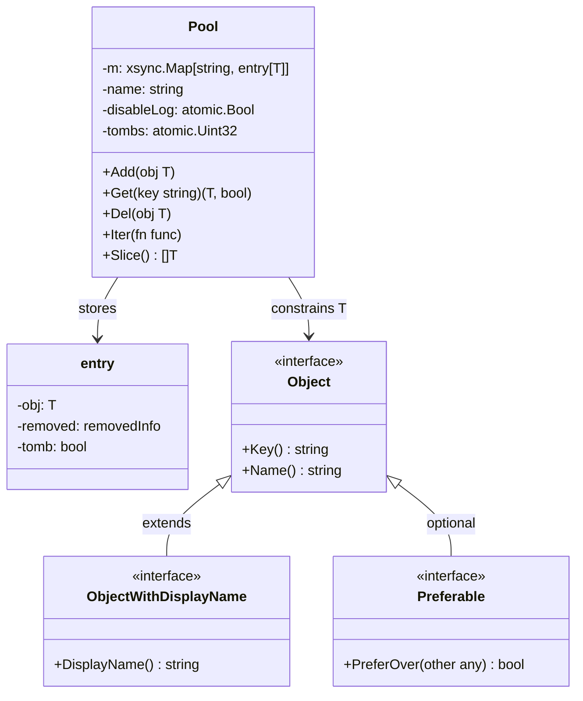
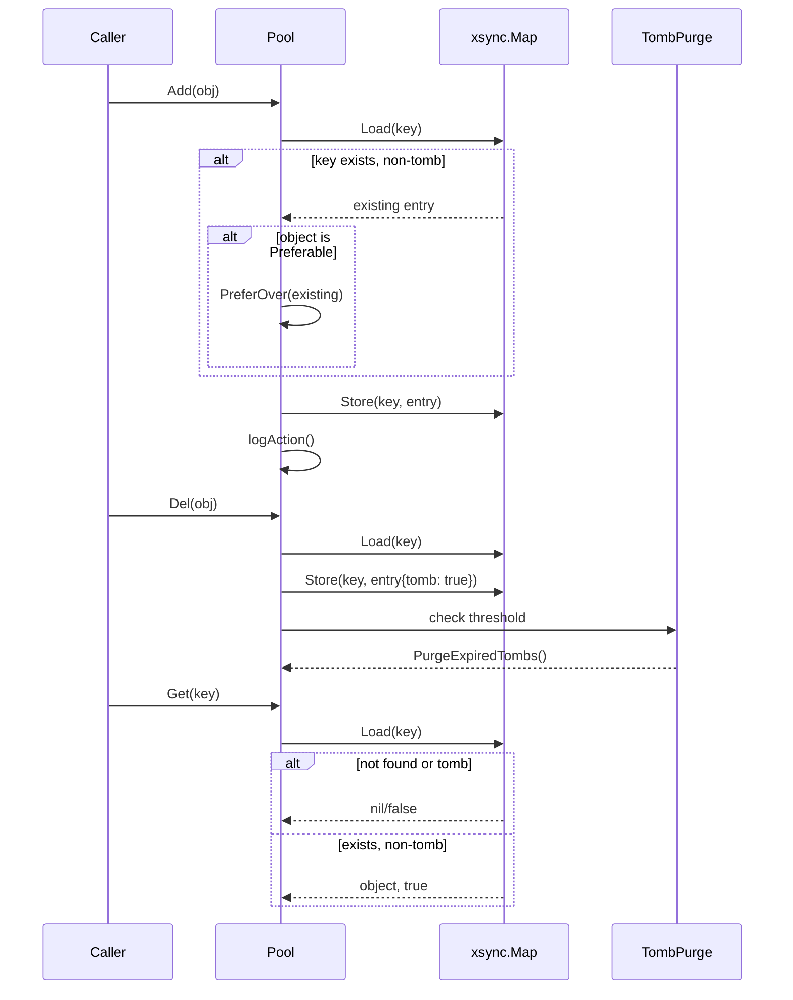

# goutils/pool

Thread-safe object pool for managing collections of objects with string keys.

## Overview

The `pool` package provides a generic, thread-safe pool for managing objects that have unique string identifiers. It uses `xsync.Map` for lock-free concurrent operations and implements a tombstone pattern for safe deletion with TTL-based cleanup.

### Purpose

- Manage collections of keyed objects in concurrent environments
- Provide deterministic object replacement through the `Preferable` interface
- Support soft deletes with time-based reclamation
- Enable sorted iteration and bulk retrieval

### Non-goals

- Does not provide LRU or eviction policies
- Does not handle object lifecycle (creation/destruction)
- Does not provide pooling of reusable object instances (this is a registry, not an object pool)

### Stability

The public API is stable. The `entry[T]` internal type and tombstone implementation details may change.

## Public API

### Exported Types

```go
type Pool[T Object] struct {
    // m is the internal map storing entries with tombstone support
    m *xsync.Map[string, entry[T]]
    // name is the pool identifier used in log messages
    name string
    // disableLog controls whether add/remove operations are logged
    disableLog atomic.Bool
    // tombs tracks the number of active tombstones for purge thresholding
    tombs atomic.Uint32
}
```

**Invariants:**

- All objects must have unique `Key()` values
- `Key()` must be stable for the lifetime of the object in the pool
- The pool maintains strong consistency for all operations

#### Object Interface

```go
type Object interface {
    Key() string  // Unique identifier for the object
    Name() string // Display name for logging and sorting
}
```

All pooled objects must implement this interface. `Key()` must return a unique string; `Name()` is used for logging and sorted output.

#### ObjectWithDisplayName Interface

```go
type ObjectWithDisplayName interface {
    Object
    DisplayName() string // Alternative display name
}
```

Extends `Object` for objects that have a separate display name from their internal name. The display name takes precedence in log messages.

#### Preferable Interface

```go
type Preferable interface {
    PreferOver(other any) bool // Returns true if this object should replace 'other'
```

Allows objects to express deterministic replacement preference when multiple objects with the same key are added. When `AddKey` is called with a key that already exists, the new object replaces the existing one only if `new.PreferOver(old)` returns `true`.

### Exported Functions and Methods

#### New

```go
func New[T Object](name string) *Pool[T]
```

Creates a new pool with the given name. The name is used as a prefix in log messages.

**Concurrency:** Safe to call during initialization.

#### Add

```go
func (p *Pool[T]) Add(obj T)
```

Adds an object to the pool using `obj.Key()` as the key. If an object with the same key exists and is not a tombstone, the `Preferable` interface is checked to determine replacement.

**Behavior:**

- If key does not exist: object is added, logged as "added"
- If key exists with non-tombstone: replacement depends on `Preferable`
- If key exists with tombstone < TTL old: logged as "reloaded"
- Tombstone counter is decremented if reloading a recent tombstone

**Concurrency:** Safe for concurrent use.

#### AddKey

```go
func (p *Pool[T]) AddKey(key string, obj T)
```

Same as `Add` but with an explicit key. The key is used instead of `obj.Key()`.

**Concurrency:** Safe for concurrent use.

#### AddIfNotExists

```go
func (p *Pool[T]) AddIfNotExists(obj T) (actual T, added bool)
```

Adds an object only if the key does not exist or has an expired tombstone.

**Returns:**

- `(existingObject, false)` if key exists with non-tombstone
- `(existingObject, false)` if key exists with recent tombstone
- `(newObject, true)` if key does not exist or tombstone expired

**Concurrency:** Safe for concurrent use.

#### Del

```go
func (p *Pool[T]) Del(obj T)
```

Marks an object as deleted using a tombstone. The object remains in the map for `recentlyRemovedTTL` (1 second) to prevent rapid add/delete cycles.

**Concurrency:** Safe for concurrent use.

#### DelKey

```go
func (p *Pool[T]) DelKey(key string)
```

Deletes by key without requiring the full object.

**Concurrency:** Safe for concurrent use.

#### Get

```go
func (p *Pool[T]) Get(key string) (T, bool)
```

Retrieves an object by key.

**Returns:**

- `(object, true)` if key exists and is not a tombstone
- `(zeroValue, false)` if key does not exist or is a tombstone

**Concurrency:** Safe for concurrent use.

#### Size

```go
func (p *Pool[T]) Size() int
```

Returns the total number of entries including tombstones.

**Concurrency:** Safe; returns an approximate count if called during concurrent modifications.

#### Clear

```go
func (p *Pool[T]) Clear()
```

Removes all entries including tombstones from the pool.

**Concurrency:** Safe for concurrent use.

#### Iter

```go
func (p *Pool[T]) Iter(fn func(k string, v T) bool)
```

Iterates over all non-tombstone entries. The callback receives the key and object. Iteration stops if the callback returns `false`.

**Concurrency:** Safe for concurrent use; may observe partial results if entries are modified during iteration.

#### Slice

```go
func (p *Pool[T]) Slice() []T
```

Returns a sorted slice of all non-tombstone objects, sorted by `Name()`.

**Concurrency:** Safe for concurrent use.

#### DisableLog

```go
func (p *Pool[T]) DisableLog(v bool)
```

Disables or enables logging of add/remove operations. When `true`, operations are not logged at INFO level.

**Default:** `false` (logging enabled)

#### PurgeExpiredTombs

```go
func (p *Pool[T]) PurgeExpiredTombs() (purged int)
```

Removes all tomstones older than `recentlyRemovedTTL` (1 second). Called automatically when the tombstone count exceeds the threshold (256), but can also be called manually.

**Returns:** Number of tombstones purged

**Concurrency:** Safe for concurrent use.

## Usage Example

```go
package main

import (
    "fmt"

    "github.com/yusing/godoxy/goutils/pool"
)

type Server struct {
    id   string
    name string
    addr string
}

func (s Server) Key() string  { return s.id }
func (s Server) Name() string { return s.name }

func main() {
    p := pool.New[Server]("servers")

    // Add servers
    p.Add(Server{"1", "web-01", "10.0.0.1"})
    p.Add(Server{"2", "web-02", "10.0.0.2"})

    // Retrieve a server
    if srv, ok := p.Get("1"); ok {
        fmt.Println("Found:", srv.name)
    }

    // Delete a server
    p.Del(Server{"1", "web-01", "10.0.0.1"})

    // Iterate over all servers
    p.Iter(func(key string, s Server) bool {
        fmt.Println(key, s.name)
        return true
    })

    // Get sorted slice
    all := p.Slice()
    for _, s := range all {
        fmt.Println(s.Name())
    }
}
```

## Architecture

### Core Components



### Data Flow



### Tombstone Mechanism

Deleted objects are marked with a tombstone and retained for 1 second (`recentlyRemovedTTL`). This prevents rapid add/delete cycles from causing inconsistent state. When the tombstone count exceeds 256, `PurgeExpiredTombs` is automatically called.

## Observability

### Logs

All operations are logged at INFO level unless disabled via `DisableLog`:

- **Add**: `"poolname: added displayname (name)"` or `"poolname: added name"`
- **Delete**: `"poolname: removed displayname (name)"` or `"poolname: removed name"`
- **Reload**: `"poolname: reloaded displayname (name)"`

The pool `name` is used as a logger prefix.

### Debug Build

When built with `-tags debug`, the pool logs a warning with stacktrace if a key already exists during `AddKey`, helping identify duplicate key issues during development.

## Performance Characteristics

- **Lock-free reads**: `Get` and `Iter` use lock-free operations via `xsync.Map`
- **Write contention**: `Add`, `Del`, and `Clear` may contend on hash bucket locks
- **Memory**: Each entry has overhead for tombstone tracking (~32 bytes)
- **Slice sorting**: `Slice` sorts by `Name()` which is O(n log n)

## Failure Modes

| Failure                          | Behavior                          | Recovery                             |
| -------------------------------- | --------------------------------- | ------------------------------------ |
| Duplicate key without Preferable | New object silently replaces old  | Use Preferable or fix key assignment |
| Key not found on Get/Del         | Returns `false` / no-op           | Caller handles missing key           |
| Tombstone threshold exceeded     | Automatic purge of old tombstones | Purge is non-blocking                |

## Dependencies

- **github.com/puzpuzpuz/xsync/v4**: Lock-free concurrent map
- **github.com/rs/zerolog**: Structured logging

## Testing Notes

The package tests cover:

- Concurrent add/get operations
- Tombstone TTL behavior
- Preference-based replacement
- Sorted slice output
- Debug build stacktrace verification
