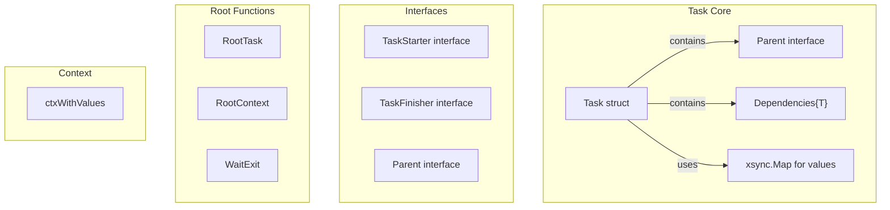
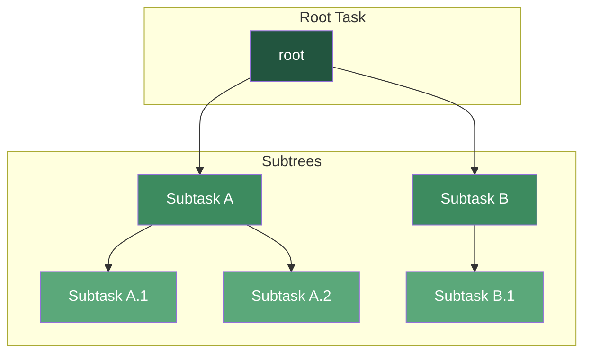
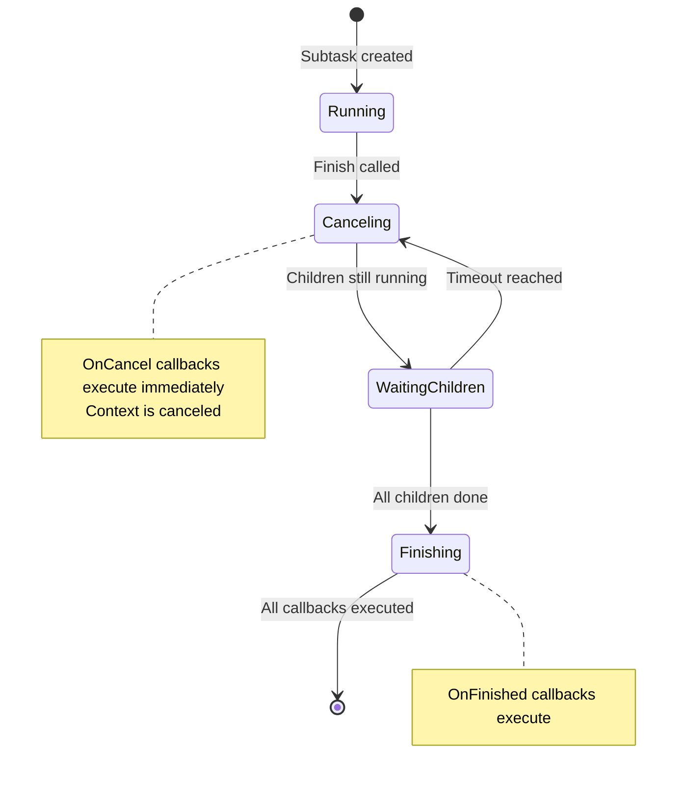
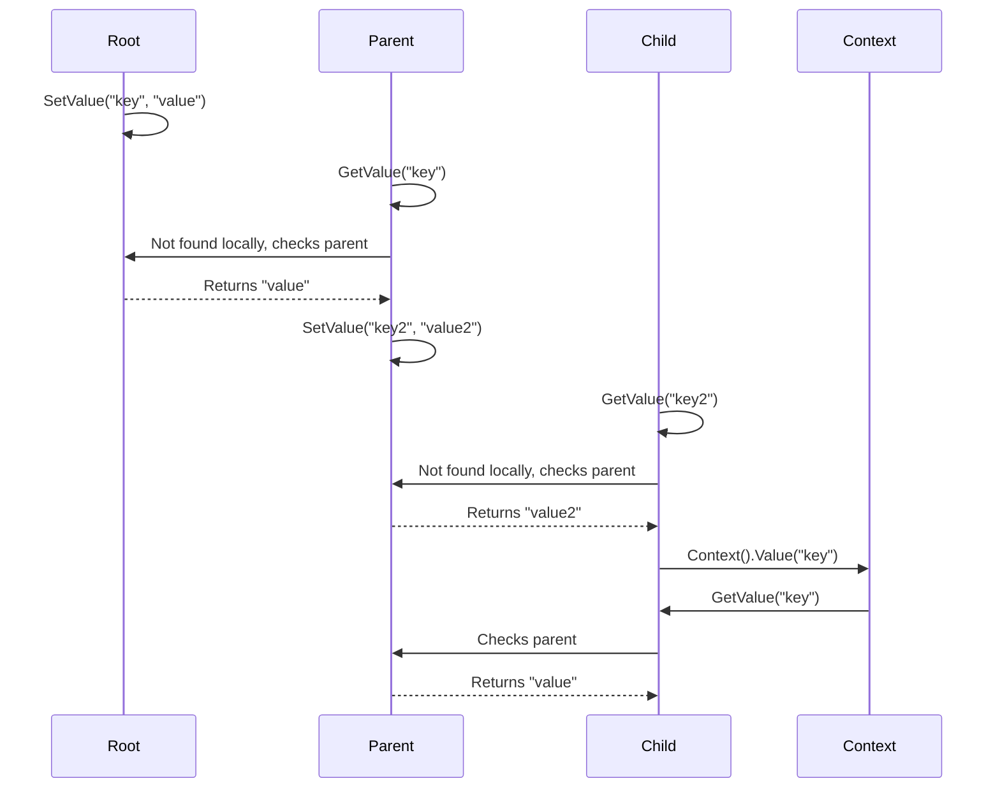
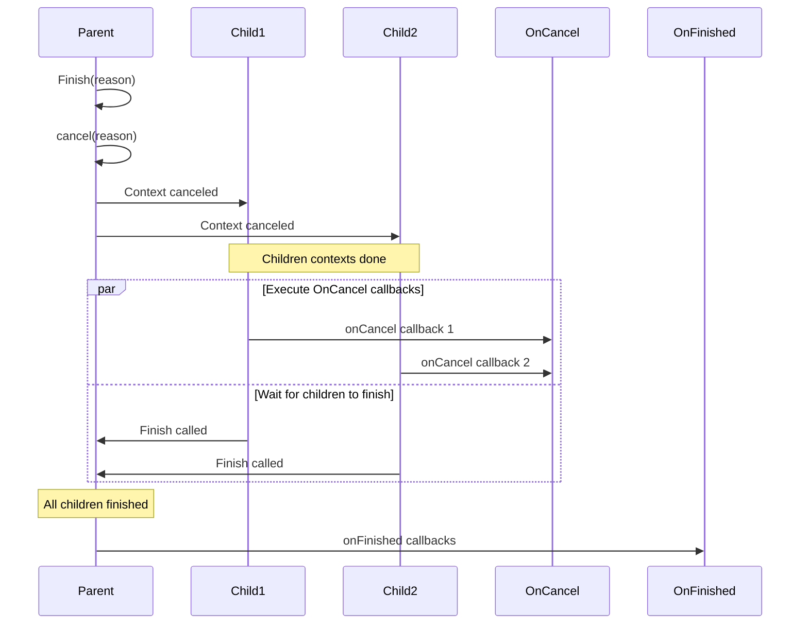

# task

Task utility package for managing object lifetimes with hierarchical subtasks, callbacks, and graceful shutdown.

## Overview

The `task` package provides a structured lifetime management system for Go applications. It implements a hierarchical task tree where parent tasks control the lifecycle of child tasks, enabling coordinated shutdown, context propagation, and cleanup callbacks.

### Purpose

- Manage hierarchical object lifetimes in long-running applications
- Coordinate graceful shutdown across multiple subsystems
- Propagate context and values from root to all subtasks
- Ensure cleanup callbacks execute in the correct order (cancel before finish)

### Primary Consumers

- Core application components (`internal/` packages)
- Docker container watchers and controllers
- API servers and background workers
- Any package requiring coordinated lifecycle management

### Non-goals

- Does not provide thread pooling or work scheduling
- Does not handle retry logic or backoff strategies

### Stability

- Exported types and functions are stable
- Internal implementation may evolve, preserving public contracts
- `debug` build tag enables additional logging for development

## Concepts and Terminology

| Term                    | Definition                                                                     |
| ----------------------- | ------------------------------------------------------------------------------ |
| **Task**                | A node in the hierarchical lifetime tree controlling object lifecycle          |
| **Root Task**           | The top-level task, parent of all other tasks, derived from background context |
| **Subtask**             | A child task whose context is derived from its parent                          |
| **Finish**              | The act of signaling a task to stop; triggers context cancellation             |
| **OnCancel Callback**   | Callback that runs immediately when task context is done                       |
| **OnFinished Callback** | Callback that runs after all subtasks have finished                            |
| **needFinish**          | Boolean flag indicating whether task requires explicit finish tracking         |
| **Dependencies**        | Generic container tracking child tasks or callbacks                            |

## Public API

### Exported Types

#### Task struct

The core type managing object lifetime. Objects using Task should implement `TaskStarter` and `TaskFinisher` interfaces.

```go
type Task struct {
    // parent is the parent task in the hierarchy
    parent *Task

    // name is the interned task name for memory efficiency
    name intern.Handle[string]

    // ctx is the derived context for this task
    ctx context.Context

    // cancel is the cancel function for the context
    cancel context.CancelCauseFunc

    // done is closed when task is finished (nil or closedCh if needFinish is false)
    done chan struct{}

    // finishCalled tracks if Finish has been called (idempotent)
    finishCalled bool

    // callbacks stores registered callbacks
    callbacks *Dependencies[*Callback]

    // children stores subtasks
    children *Dependencies[*Task]

    // values stores context values (atomic pointer to xsync.Map)
    values atomic.Pointer[xsync.Map[any, any]]

    // mu protects finishCalled and lazy-initialized fields
    mu sync.Mutex
}
```

**Invariants:**
- A task can only be finished once (idempotent Finish calls)
- All subtasks finish before parent OnFinished callbacks execute
- OnCancel callbacks execute immediately when context is done
- The task tree forms a directed acyclic graph rooted at the root task

#### Parent interface

Interface that Task implements for creating and managing subtasks.

```go
type Parent interface {
    // Context returns the task's context for deriving child contexts
    Context() context.Context

    // Subtask creates a new child task with the given name
    Subtask(name string, needFinish bool) *Task

    // Name returns the task's name
    Name() string

    // Finish signals the task to stop with the given reason
    Finish(reason any)

    // OnCancel registers a callback for when context is done
    OnCancel(name string, f func())

    // SetValue stores a value in the task's context
    SetValue(key any, value any)

    // GetValue retrieves a value from the task's context
    GetValue(key any) any
}
```

#### TaskStarter interface

Interface for objects that need to be started with a parent task.

```go
type TaskStarter interface {
    // Start initializes the object and returns an error if it fails
    Start(parent Parent) error

    // Task returns the task associated with this object
    Task() *Task
}
```

**Contract:** Caller must invoke `subtask.Finish()` when start fails or the object finishes.

#### TaskFinisher interface

Interface for objects that need cleanup when finished.

```go
type TaskFinisher interface {
    Finish(reason any)
}
```

#### Dependencies[T] struct

Generic container for tracking dependencies with concurrent-safe operations.

```go
type Dependencies[T comparable] struct {
    m     *xsync.Map[T, struct{}]  // concurrent-safe map
    count atomic.Int64              // number of elements
    done  atomic.Pointer[chan struct{}]  // channel closed when count reaches 0
}
```

### Exported Functions and Methods

#### Root-level Functions

```go
// RootTask creates a new task derived from the root task context
func RootTask(name string, needFinish bool) *Task

// RootContext returns the root task's context
func RootContext() context.Context

// RootContextCanceled returns a channel closed when root context is done
func RootContextCanceled() <-chan struct{}

// OnProgramExit registers a callback to run on program shutdown
func OnProgramExit(about string, fn func())

// WaitExit waits for shutdown signal, then gracefully shuts down
func WaitExit(shutdownTimeout int)
```

#### Task Methods

```go
// Context returns a context.Context that also returns task values via Value()
func (t *Task) Context() context.Context

// Name returns the task's name (not including parent names)
func (t *Task) Name() string

// String returns the full hierarchical name (e.g., "root.child.grandchild")
func (t *Task) String() string

// Finish signals the task to stop (asynchronous, returns immediately)
func (t *Task) Finish(reason any)

// FinishCause returns the error that caused the task to finish
func (t *Task) FinishCause() error

// FinishAndWait signals stop and waits for all subtasks to finish
func (t *Task) FinishAndWait(reason any)

// OnFinished registers a callback after all subtasks complete
// Should not be called after Finish
func (t *Task) OnFinished(about string, fn func())

// OnCancel registers a callback when context is done
// Should not be called after Finish
func (t *Task) OnCancel(about string, fn func())

// Subtask creates a child task
// Should not be called after Finish on this task or its parent
func (t *Task) Subtask(name string, needFinish bool) *Task

// SetValue stores a value in this task's context (thread-safe)
func (t *Task) SetValue(key any, value any)

// GetValue retrieves a value, searching this task and parents (thread-safe)
func (t *Task) GetValue(key any) any
```

#### Concurrency Guarantees

- All exported methods are safe for concurrent use
- Finish is idempotent (multiple calls wait but only report stuck once)
- SetValue/GetValue use atomic operations for lock-free reads
- Dependencies use xsync.Map for concurrent-safe add/delete/range

#### Lifecycle Rules

1. Subtasks must be created before Finish is called on parent
2. Callbacks (OnCancel/OnFinished) must be registered before Finish
3. When a parent finishes, all children contexts are canceled
4. OnFinished callbacks execute only after all children have finished
5. Task tree forms a hierarchy; root task cannot be finished

## Architecture

### Core Components



### Component Responsibilities

| Component         | Responsibility                                                 |
| ----------------- | -------------------------------------------------------------- |
| `Task`            | Lifetime management, context derivation, callback registration |
| `Dependencies[T]` | Track child tasks or callbacks with Wait semantics             |
| `ctxWithValues`   | Wrap context.Context to include task values                    |
| `RootTask`        | Initialize root task on package init                           |
| `WaitExit`        | Signal handling and graceful shutdown coordination             |

### Task Tree Structure



### Lifecycle State Machine



## Pipeline / Data Flow

### Value Propagation Flow



### Finish Propagation Flow



## Configuration Surface

This package does not accept external configuration. All behavior is controlled programmatically via function parameters.

### Key Parameters

| Parameter         | Type     | Default    | Description                                |
| ----------------- | -------- | ---------- | ------------------------------------------ |
| `name`            | `string` | (required) | Task name for identification and debugging |
| `needFinish`      | `bool`   | (required) | Whether to track finish completion         |
| `shutdownTimeout` | `int`    | (required) | Seconds to wait in `WaitExit`              |
| `taskTimeout`     | `const`  | 3s         | Internal timeout for stuck detection       |

## Dependency and Integration Map

### Internal Dependencies

| Package                            | Purpose                              |
| ---------------------------------- | ------------------------------------ |
| `github.com/puzpuzpuz/xsync/v4`    | Concurrent-safe map for dependencies |
| `github.com/yusing/goutils/intern` | String interning for task names      |

## Observability

### Logs

| Level  | Build Flag | Message                                            | Condition                                 |
| ------ | ---------- | -------------------------------------------------- | ----------------------------------------- |
| `Info` | `debug`    | `task <name> started`                              | Debug build only, when subtask created    |
| `Info` | `debug`    | `task <name> finished`                             | Debug build only, when task finished      |
| `Warn` | all        | `<task> stucked callbacks: N, stucked children: M` | Timeout exceeded during graceful shutdown |

**Logged identifiers:** Task full name (hierarchy), callback names

### Metrics

No metrics are currently exported.

### Tracing

- Context propagation follows standard `context.Context` patterns
- Task context can be used with OpenTelemetry or similar tracers
- `Context().Value()` does not interfere with tracing keys

## Security Considerations

- Task names are interned but should not contain sensitive data
- Callbacks run with recover() to prevent panics from crashing the application
- In debug builds, panic stack traces may expose internal structure
- No network access or file I/O in core package

## Performance Characteristics

### Big-O Analysis

| Operation           | Complexity               |
| ------------------- | ------------------------ |
| `Subtask`           | O(1) amortized           |
| `Finish`            | O(1)                     |
| `FinishAndWait`     | O(children + callbacks)  |
| `SetValue`          | O(1) atomic              |
| `GetValue`          | O(tree depth) worst case |
| `Dependencies.Wait` | O(1) channel wait        |

### Backpressure

- `FinishAndWait` blocks until all children finish or timeout
- `WaitExit` respects the configured shutdown timeout
- Stuck tasks are reported but do not block indefinitely

## Failure Modes and Recovery

| Failure Mode              | Symptom                                   | Recovery                             |
| ------------------------- | ----------------------------------------- | ------------------------------------ |
| Child task stuck          | `FinishAndWait` timeout, warning log      | Manual restart; investigate callback |
| Multiple `Finish` calls   | Only first reports stuck, subsequent wait | Idempotent by design                 |
| Callback panic            | Logged with callback name, debug stack    | Recovered, application continues     |
| Context cancellation leak | Resources not released                    | Ensure `Finish` is called on parent  |

### Stuck Task Detection

When `FinishAndWait` or `WaitExit` exceeds the 3-second timeout, the package logs a warning containing:
- Task name and hierarchy
- Names of all stuck callbacks
- Names of all stuck child tasks

Example log output:
```
WARN | my-app stucked callbacks: 2, stucked children: 1
```

### Retry Guidance

- Task finish is not automatically retried
- Callbacks should be idempotent where possible
- For transient failures, implement retry logic in the callback itself

## Usage Examples

### Basic: Simple Task Hierarchy

```go
func main() {
    root := task.RootTask("app", true)

    // Create subtasks
    db := root.Subtask("database", true)
    api := root.Subtask("api", true)

    // Register cleanup
    db.OnCancel("close-connections", func() {
        dbPool.Close()
    })

    api.OnCancel("shutdown-server", func() {
        apiServer.Shutdown()
    })

    sigCh := make(chan os.Signal, 1)
    signal.Notify(sigCh, syscall.SIGINT, syscall.SIGTERM)
    <-sigCh

    root.Finish(nil)
    task.WaitExit(30)
}
```

### Advanced: TaskStarter/TaskFinisher Pattern

```go
type Database struct {
    task *task.Task
    conn *sql.DB
}

func (d *Database) Start(parent task.Parent) error {
    d.task = parent.Subtask("database", true)

    var err error
    d.conn, err = sql.Open("postgres", dsn)
    if err != nil {
        d.task.Finish(err)
        return err
    }

    go d.backgroundSync()
    return nil
}

func (d *Database) Task() *task.Task {
    return d.task
}

func (d *Database) Finish(reason any) {
    d.task.Finish(reason)
}

func (d *Database) backgroundSync() {
    for {
        select {
        case <-d.task.Context().Done():
            d.conn.Close()
            return
        case <-time.After(time.Minute):
            d.sync()
        }
    }
}
```

### Integration: Full Application Setup

```go
type App struct {
    db    *Database
    api   *HTTPServer
    cache *Cache
}

func (a *App) Run() error {
    root := task.RootTask("myapp", true)

    // Start all components
    if err := a.db.Start(root); err != nil {
        return err
    }
    if err := a.api.Start(root); err != nil {
        a.db.Finish(err)
        return err
    }
    if err := a.cache.Start(root); err != nil {
        a.api.Finish(err)
        a.db.Finish(err)
        return err
    }

    // Wait for shutdown signal
    task.WaitExit(30)

    // Components already finished via root cancellation
    return nil
}
```

## Testing Notes

### Test Helper

The package provides `testCleanup()` for resetting the root task between tests:

```go
func TestMyFeature(t *testing.T) {
    t.Cleanup(task.testCleanup)

    task := task.RootTask("test", true)
    // ...
}
```

### Determinism

- Tests use `taskCleanup()` to ensure isolation
- Time-based operations (timeouts) may vary slightly
- Use `testTask()` helper for consistent setup

### Test Coverage

- `task_test.go`: Lifecycle, callbacks, shutdown scenarios
- `values_test.go`: Context value propagation

### Build Tags

- Default: Production build (minimal logging)
- `-tags debug`: Development build with detailed logging and panic stacks

## Debug Mode

When built with `-tags debug`:

- Task start/finish events are logged at Info level
- Panics in callbacks include full stack traces
- Useful for development and troubleshooting lifecycle issues

```bash
go build -tags debug -o myapp ./cmd/myapp
```
