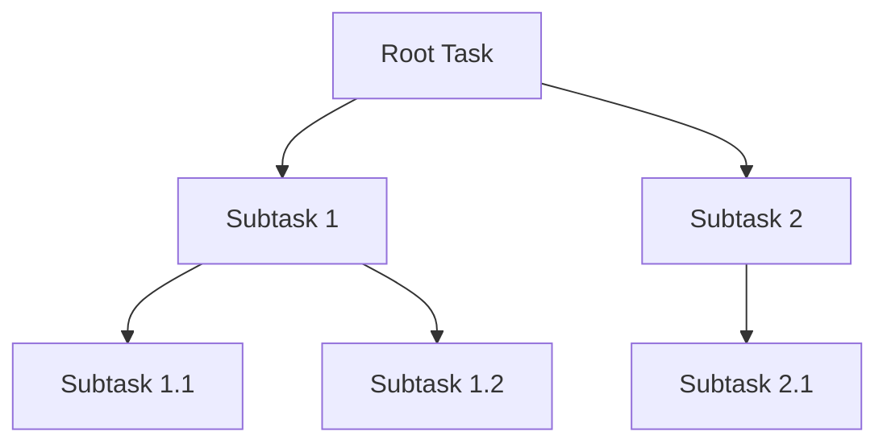

# task

Task utilities for managing object lifetimes with subtasks and callbacks.

## Overview

The `task` package provides a task-based lifetime management system with support for subtasks, callbacks, and graceful shutdown.

## API Reference

### Types

```go
type Task struct {
    parent       *Task
    name         intern.Handle[string]
    ctx          context.Context
    cancel       context.CancelCauseFunc
    done         chan struct{}
    finishCalled bool
    callbacks    *Dependencies[*Callback]
    children     *Dependencies[*Task]
}

type Parent interface {
    Context() context.Context
    Subtask(name string, needFinish bool) *Task
    Name() string
    Finish(reason any)
    OnCancel(name string, f func())
}

type TaskStarter interface {
    Start(parent Parent) gperr.Error
    Task() *Task
}

type TaskFinisher interface {
    Finish(reason any)
}
```

### Task Methods

```go
func (t *Task) Context() context.Context
func (t *Task) Name() string
func (t *Task) String() string
func (t *Task) Finish(reason any)
func (t *Task) FinishCause() error
func (t *Task) FinishAndWait(reason any)
func (t *Task) OnFinished(about string, fn func())
func (t *Task) OnCancel(about string, fn func())
func (t *Task) Subtask(name string, needFinish bool) *Task
```

### Root Functions

```go
func RootTask(name string, needFinish bool) *Task
func RootContext() context.Context
func RootContextCanceled() <-chan struct{}
func OnProgramExit(about string, fn func())
func WaitExit(shutdownTimeout int)
```

## Usage

```go
// Create a root task
task := task.RootTask("my-app", true)

// Create subtasks
subtask := task.Subtask("worker", true)

// Add cleanup callback
subtask.OnCancel("cleanup", func() {
    closeResources()
})

// Add finalization callback
subtask.OnFinished("finalize", func() {
    flushMetrics()
})

// Finish subtask when done
subtask.Finish(nil)

// Wait for graceful shutdown
task.WaitExit(30)
```

## Architecture



## Features

- Hierarchical task tree
- Context propagation
- Callback execution order (OnCancel before OnFinished)
- Graceful shutdown with timeout
- Stuck task detection and reporting
