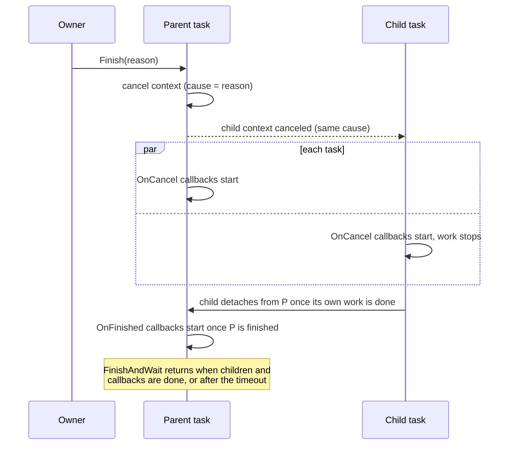

# goutils/task

Hierarchical lifetimes for the goroutines and resources of a Go program. A task
is a node in a tree that owns a cancellable context, cleanup callbacks, and
context values. Finishing a task cancels everything below it, and
`task.WaitExit` turns SIGINT, SIGTERM, or SIGHUP into one bounded, reported
graceful shutdown.

Use it when many components start and stop together and you want one shutdown
path that waits for them and tells you which one is stuck. It does not schedule
work, pool goroutines, or retry anything.

## Install

```sh
go get github.com/yusing/goutils@v0.8.0
```

```go
import "github.com/yusing/goutils/task"
```

`task` is in the root module and needs Go 1.27 or later.

## Quick start

```go
package main

import (
	"context"
	"net/http"
	"time"

	"github.com/yusing/goutils/task"
)

func main() {
	srv := &http.Server{Addr: ":8080"}

	// A task that only carries cleanup (needFinish=false) finishes by itself
	// when it is canceled.
	api := task.RootTask("api", false)
	api.OnCancel("shutdown http server", func() {
		ctx, cancel := context.WithTimeout(context.Background(), 5*time.Second)
		defer cancel()
		_ = srv.Shutdown(ctx)
	})
	go func() { _ = srv.ListenAndServe() }()

	// Blocks until SIGINT, SIGTERM, or SIGHUP. Then it cancels every task and
	// waits up to 10 seconds for callbacks and children to finish.
	task.WaitExit(10)
}
```

`WaitExit` is the last call in `main`. It returns once shutdown has completed or
the timeout expired; it does not call `os.Exit`.

## Core ideas

| Idea | Meaning |
| --- | --- |
| Process-wide root | One hidden root task exists per process. You never hold it. `RootTask(name, needFinish)` returns a child of it, and only `WaitExit` finishes it. |
| Subtask | `parent.Subtask(name, needFinish)` creates a child whose context is derived from the parent's. Cancelling the parent cancels the child. |
| `needFinish` | `true`: the task is outstanding work. Its owner must call `Finish` when done, and shutdown waits for that call. `false`: the task finishes automatically when its context is canceled. |
| `OnCancel` | A callback that starts as soon as the task's context is done. |
| `OnFinished` | A callback that starts once the task itself is finished (`needFinish=true`). On a `needFinish=false` task it is the same as `OnCancel`. |
| Values | `SetValue`/`GetValue` attach data that the task and its descendants see, also through `Context().Value`. |

Names are interned strings. `Name()` is the task's own name, and `String()` is
the dotted path from the first task below the root, for example `api.worker`.
Stuck-task reports use the dotted path.

### Choosing `needFinish`

- Use `false` for tasks that only supply a context and `OnCancel` hooks, such as
  per-request or per-connection scopes. They need no explicit `Finish` to be
  cleaned up on shutdown. Scopes created repeatedly under a long-lived parent
  should still be finished when they end (see rule 5 below).
- Use `true` for a goroutine or component that must complete work before the
  program may exit. Call `Finish` when that work ends, typically with `defer`.
  If you forget, shutdown waits for the whole timeout and reports the task as
  stuck.

## Running a component

The `TaskStarter` and `TaskFinisher` interfaces describe objects whose lifetime
is a task. A `*Task` satisfies `Parent`, so components accept either a task or
anything else that can hand out subtasks.

```go
package main

import (
	"time"

	"github.com/yusing/goutils/task"
)

type Poller struct {
	task *task.Task
}

var (
	_ task.TaskStarter  = (*Poller)(nil)
	_ task.TaskFinisher = (*Poller)(nil)
)

func (p *Poller) Start(parent task.Parent) error {
	t := parent.Subtask("poller", true)
	if err := p.connect(); err != nil {
		t.Finish(err) // the Start contract: finish the subtask when Start fails
		return err
	}
	p.task = t

	go func() {
		defer t.Finish(nil) // tells the parent's shutdown wait that we are done
		ticker := time.NewTicker(time.Minute)
		defer ticker.Stop()
		for {
			select {
			case <-t.Context().Done():
				return
			case <-ticker.C:
				p.poll()
			}
		}
	}()
	return nil
}

func (p *Poller) Task() *task.Task  { return p.task }
func (p *Poller) Finish(reason any) { p.task.Finish(reason) }
func (p *Poller) connect() error    { return nil }
func (p *Poller) poll()             {}

func main() {
	app := task.RootTask("app", false)
	if err := (&Poller{}).Start(app); err != nil {
		panic(err)
	}
	task.WaitExit(10)
}
```

Because `Poller.Start` takes a `task.Parent`, tests can pass `task.GetTestTask(t)`
and an application can pass `task.RootTask(...)` or another component's subtask.

### Ordered cleanup

Every `OnCancel` callback and every context in the tree reacts to cancellation at
the same time, in no guaranteed order. To run code after the subtasks of a task
have finished, wait for them explicitly:

```go
go func() {
	<-db.Context().Done()
	db.FinishAndWait(nil) // blocks until subtasks and callbacks are done
	conn.Close()          // runs after the subtasks have finished
}()
```

Here `db` is a `needFinish=true` task, and the goroutine finishes it.

## Finish, FinishAndWait, and timeouts

| Call | Effect |
| --- | --- |
| `Finish(reason)` | Cancels the task's context with `reason` as the cause, marks the task finished (which releases its `OnFinished` callbacks), and returns without waiting. The task leaves its parent's set of children once its own children and callbacks are done. |
| `FinishAndWait(reason)` | Same, then blocks until the task's children and callbacks have finished, or the wait times out. |
| `FinishCause()` | `context.Cause` of the task's context: `nil` while the task is running. |

`reason` may be `nil` (the cause is `context.Canceled`), an `error`, a `string`,
or any value, which is formatted with `%v`.

Timeout rules:

- Each wait gives up after 3 seconds. The value is fixed and not configurable.
- When a wait times out, the stuck report is logged at `Warn` through
  [`logging`](../logging/README.md) and the task detaches from its parent anyway.
  Callbacks still running continue in their goroutines.
- `WaitExit(seconds)` sets one budget for the whole shutdown. During shutdown no
  individual wait outlasts the remaining budget, and the root waits `seconds`
  plus 100 ms. Tasks that miss the deadline stay in the tree so the final report
  can name them.
- `WaitExit(0)` leaves no budget: unless the tree is already empty it returns
  within about 100 ms, having reported what was left.

A stuck report is one `Warn` message such as:

```text
root stucked callbacks: 0, stucked children: 1 (waiting for children: context deadline exceeded)
  • children
    • app
```

The process-wide root is canceled with the cause `task.ErrProgramExiting`.
`errors.Is(context.Cause(ctx), task.ErrProgramExiting)` tells a component that
the program is stopping rather than that one subtree was canceled.


```mermaid
sequenceDiagram
    participant Owner
    participant P as Parent task
    participant C as Child task
    Owner->>P: Finish(reason)
    P->>P: cancel context (cause = reason)
    P-->>C: child context canceled (same cause)
    par each task
        P->>P: OnCancel callbacks start
    and
        C->>C: OnCancel callbacks start, work stops
    end
    C->>P: child detaches from P once its own work is done
    P->>P: OnFinished callbacks start once P is finished
    Note over P: FinishAndWait returns when children and<br/>callbacks are done, or after the timeout
```

## Callbacks

- `OnCancel(about, fn)` and `OnFinished(about, fn)` each run `fn` in its own
  goroutine. Callbacks of one task run concurrently, in no particular order.
- `about` names the callback in stuck reports and panic logs.
- Register callbacks before the task can be canceled. A callback registered
  after cancellation may never run, and the task is then reported as stuck. For
  example, a `FinishAndWait` after such a registration waits out the full 3
  seconds.
- `OnFinished` runs when the task itself is finished. It does not wait for the
  task's subtasks. Use `FinishAndWait` when work must follow the subtasks.
- A panic in a callback is recovered and logged at `Error` with the fields
  `error` and `callback`. With `-tags debug` it is logged and then re-raised, so
  the process crashes with a stack trace.
- A task is not finished until its callbacks return. Keep callbacks short
  relative to the shutdown budget: one that is still running when the budget ends
  is reported as stuck.

## Context values

```go
type tenantKey struct{}

t := task.RootTask("server", false)
t.SetValue(tenantKey{}, "acme")

child := t.Subtask("handler", false)
child.GetValue(tenantKey{})        // "acme"
child.Context().Value(tenantKey{}) // "acme"
```

Values flow from a task down to its descendants, never up to an ancestor.
`SetValue` and `GetValue` are safe for concurrent use, and a value set after
`Context()` was called is still visible through that context. Use an unexported
key type as with `context.WithValue`.

`Context()` returns a normal `context.Context`. You can pass it to libraries or
derive from it with `context.WithTimeout`.

The [`events`](../events/README.md) package uses this mechanism to carry an event
history, and `events.SetCtx` accepts a `*task.Task`.

## Rules and pitfalls

1. Call `WaitExit` for shutdown. Do not install your own signal handler and
   then call `Finish` before `WaitExit`: `WaitExit` registers its own handler and
   waits for another signal. Callers cannot finish the hidden process-wide root,
   but a task returned by `RootTask` is an ordinary child that you may finish.
2. Every `needFinish=true` task needs exactly one meaningful `Finish`. Without
   it, shutdown stalls until the timeout and the task is reported.
3. A second `Finish` or `FinishAndWait` on the same task is safe but blocks, for
   up to the 3 second limit, until the task's pending children and callbacks are
   done. A `defer t.Finish(nil)` that runs after an explicit `Finish` therefore
   stalls while callbacks are still running.
4. Do not create subtasks or register callbacks after `Finish` on the task or its
   parent. Create them first.
5. Finish short-lived subtasks. A subtask stays in its parent's set of children,
   and in the parent's context tree, until it finishes. Creating one per request
   under a long-lived parent without finishing it leaks.
6. Callbacks and goroutines that ignore `Context().Done()` hold shutdown up. The
   stuck report lists them by task path and callback name.
7. `WaitExit` calls `signal.Notify` and never stops it. After it returns,
   SIGINT, SIGTERM, and SIGHUP no longer terminate the process by default.
8. Nothing is logged unless the application installed a logger with
   [`logging.SetLogger`](../logging/README.md). Task behavior does not depend on
   whether a logger is installed.
9. The process-wide root stays canceled after shutdown, so tasks created later
   are canceled from the start.

## Testing

Use `GetTestTask` as the parent of the code under test. It returns a task whose
context ends with the test, cached per `testing.TB`, and not attached to the
process-wide root. Do not call `Finish` on that task itself: it needs no
cleanup, and it is not part of the shutdown tree. Create a subtask under it when
the test needs a scope to cancel.

```go
package worker_test

import (
	"testing"

	"github.com/yusing/goutils/task"
)

func TestWorkerStopsWithItsScope(t *testing.T) {
	scope := task.GetTestTask(t).Subtask("scope", true)

	worker := scope.Subtask("worker", true)
	stopped := false
	go func() {
		defer worker.Finish(nil)
		<-worker.Context().Done()
		stopped = true
	}()

	scope.FinishAndWait(nil) // cancels the worker and waits for it to finish
	if !stopped {
		t.Fatal("worker did not stop")
	}
}
```

Tasks made with `RootTask` in a test hang off the process-wide root for the rest
of the test binary. Prefer `GetTestTask`. The package's own reset helper is
unexported, so external tests cannot restore the root.

## API reference

| Symbol | Notes |
| --- | --- |
| `RootTask(name string, needFinish bool) *Task` | Subtask of the process-wide root. |
| `RootContext() context.Context` | Context of the process-wide root. It is canceled at shutdown with cause `ErrProgramExiting`. |
| `RootContextCanceled() <-chan struct{}` | Its `Done` channel. |
| `OnProgramExit(about string, fn func())` | `OnCancel` on the root. `fn` starts when shutdown begins, and shutdown waits for it. |
| `WaitExit(shutdownTimeout int)` | Waits for SIGINT, SIGTERM, or SIGHUP, then shuts down. The timeout is in seconds. |
| `ErrProgramExiting` | Cause of the root's cancellation. |
| `(*Task).Subtask(name string, needFinish bool) *Task` | Creates a child. |
| `Context`, `Name`, `String`, `MarshalText` | Context, short name, dotted path, and the dotted path as text. |
| `Finish`, `FinishAndWait`, `FinishCause` | See above. |
| `OnCancel`, `OnFinished` | Callbacks, see above. |
| `SetValue`, `GetValue` | Values. |
| `Parent` | Interface implemented by `*Task`: `Context`, `Subtask`, `Name`, `Finish`, `OnCancel`, `SetValue`, `GetValue`. |
| `TaskStarter` | `Start(parent Parent) error` and `Task() *Task`. The implementation must finish its subtask when `Start` fails or the object ends. |
| `TaskFinisher` | `Finish(reason any)`. |
| `GetTestTask(tb testing.TB) *Task` | Test parent task. |
| `Dependencies[T comparable]`, `NewDependencies`, `Callback` | Support types: a concurrent set that can be waited on until it is empty, and the opaque callback record. Normally not used directly. |

Run `go doc -all github.com/yusing/goutils/task` for signatures and doc comments.

## Build tags

| Tag | Effect |
| --- | --- |
| `debug` | Logs `task <path> started` and `task <path> finished` at `Info` for every subtask, and makes a recovered callback panic fatal after logging. |

## Dependencies

`github.com/puzpuzpuz/xsync/v4`, plus `intern`, `errs`, and
[`logging`](../logging/README.md) from this module.
